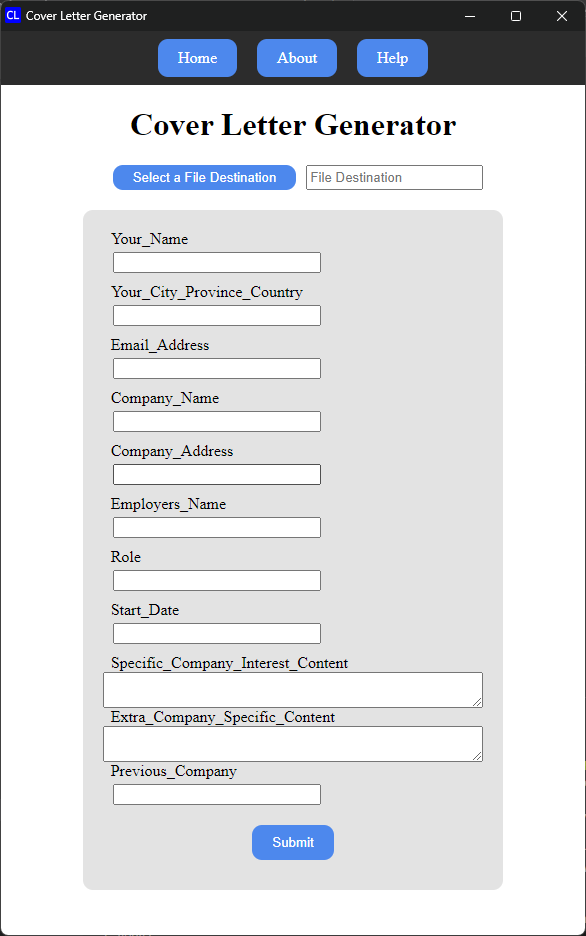
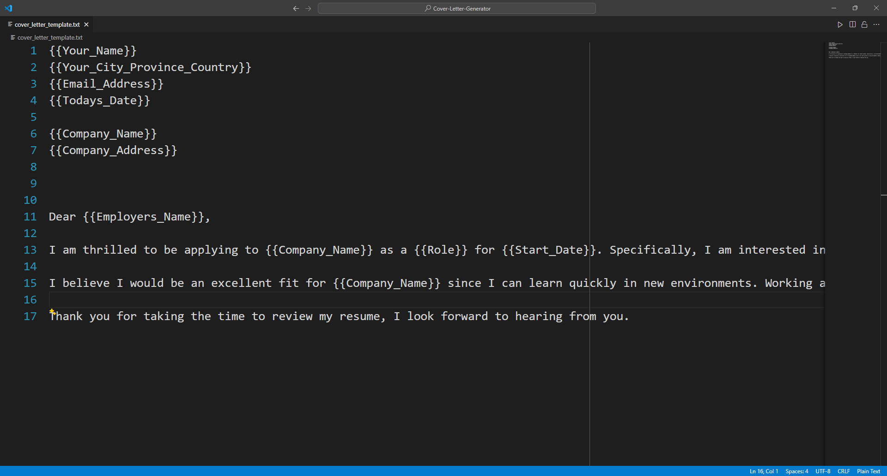

# Overview

A simple cover letter generator to help you automate your cover letter writing process. Often times you may be applying to multiple jobs and need to write a cover letter for each job. This application helps you automate the process by allowing you to create a template and then fill in the blanks with your own content.

- Developed by: [Brendan Smiley](https://github.com/b-smiley/)
- License: MIT
- GUI Preview
  
- Template Preview
  

# Getting Started

## Downloading the application

🎵 NOTE 🎵 Releases are not current available but when they are,

To get started, you can download the installer from the releases page.[here](https://github.com/b-smiley/Cover-Letter-Generator/releases)
.

🎵 NOTE 🎵 this application is **NOT** code signed meaning your Windows, Mac, or Linux operating system may block the application from running. Code signing costs hundreds of dollars for a 3rd-party to validate your code, which is why I have not code-signed this open-source application.

- For Windows, you can bypass this by clicking on the "More Info" button and then clicking "Run Anyway".

## Building your own template

I have provided a sample template (my own cover letter) to help you get started. You can find this template in the same folder you installed the application to. Use {{Placeholder Names}} to help you automate your cover letter writing process. These placeholders will be replaced with your own content when you generate your cover letter.
There are special placeholders you can use, see the Features section below for more information.

# Features

You can utilize the following list of special placeholder variables to help you automate your cover letter past default text values:

- `{{TodaysDate}}` - Current date in format `YYYY-MM-DD`
- `{{YourName}} and {{CompanyName}}` - Autopopulates the file name as YourName_CompanyName.pdf
- `{{*_Content}}` - Gives you a bigger text box to write your content

# Building the application

`pip install -r requirements.txt`
`pip install pyinstaller`
`python -m eel app.py web`

# Contributing 🧑‍🤝‍🧑, Feature Requests ➕, Bugs 🐛

- Please feel free to contribute to this project by submitting a pull request.
  - The requirement.txt and main.py are the places to start.
- If you have any feature requests, please submit an issue.
- If you find any bugs, please submit an issue.

### A Note to Employers

If you are viewing my GitHub profile and see this project, odds are your cover letter was generated using this application 😉.
